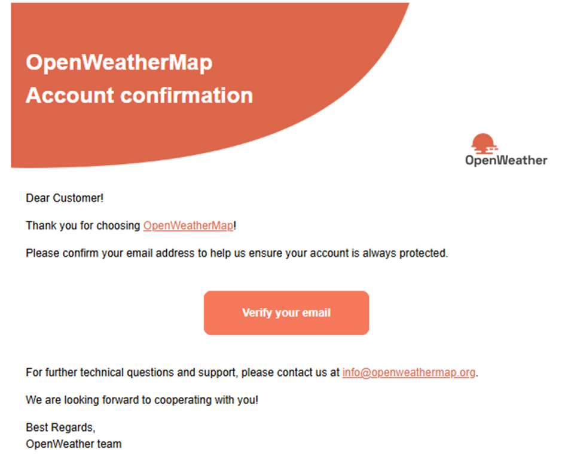
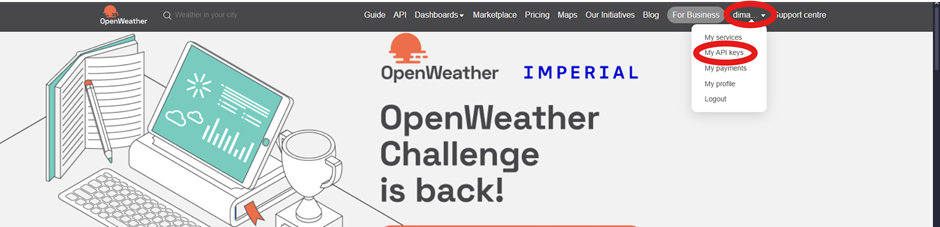
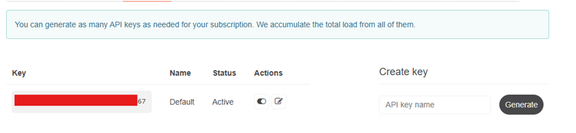
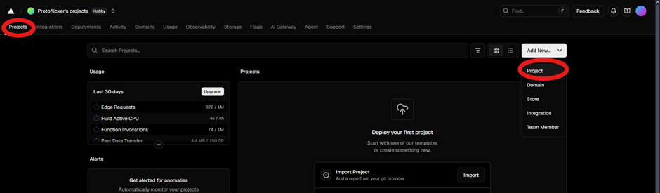
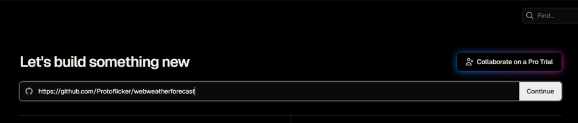
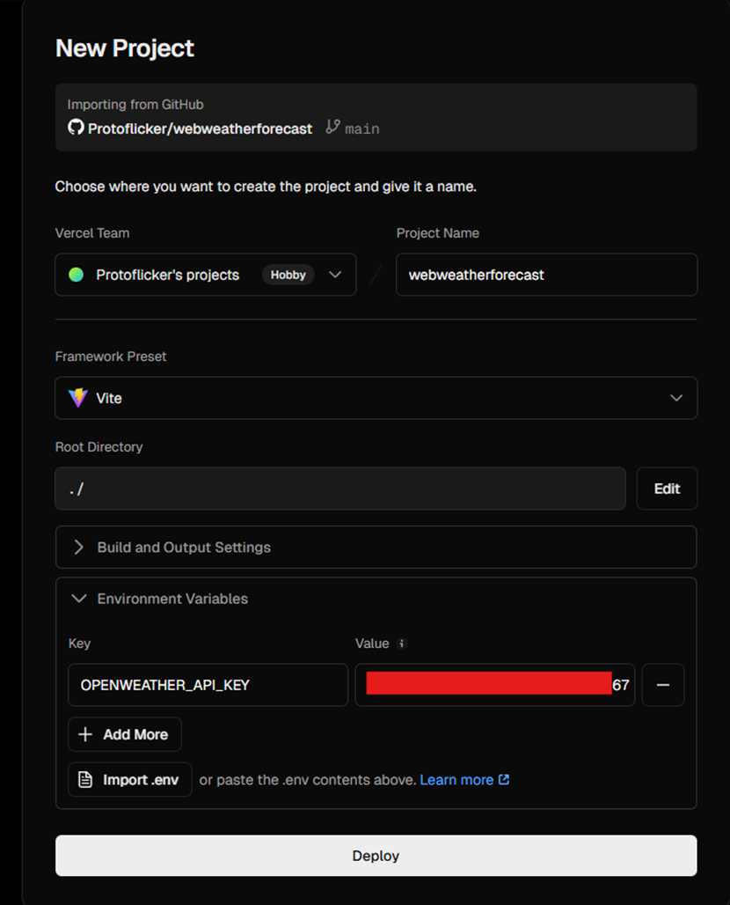
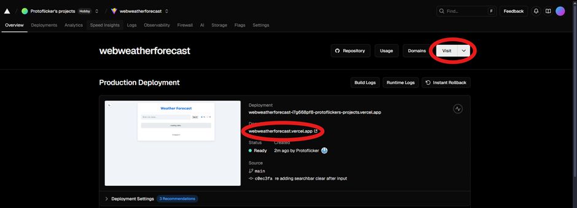
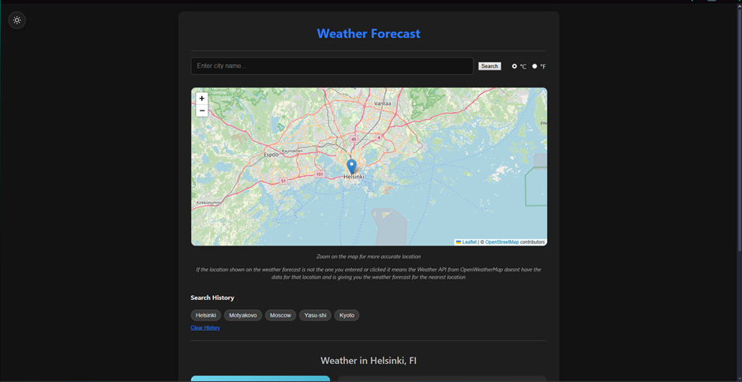
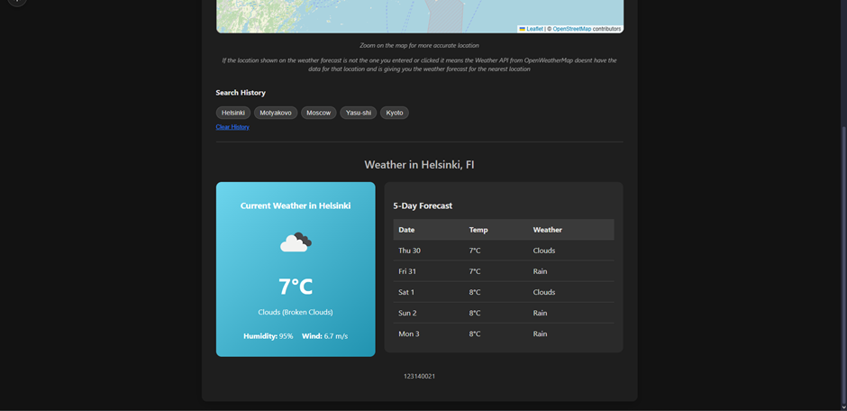

# Weather Forecast Dashboard

A modern weather dashboard built with React, Vite, and Vercel Serverless Functions.  
This application displays real-time weather data, a 5-day forecast, and an interactive map for the searched location.

---

## Author

**Name:** Adi Septriansyah  
**NIM:** 123140021  

**Deployment Link:** [https://webweatherforecast.vercel.app/](https://webweatherforecast.vercel.app/)

---

## Description

This project is a weather dashboard that allows users to search and view weather data from cities around the world.  
The data is fetched from the **OpenWeatherMap API**.

For security reasons, the API key is not exposed on the client side.  
All API requests are handled through **secure serverless functions** hosted on **Vercel**, ensuring the key remains private.

---

## Key Features

- Secure API handling through Vercel Serverless Functions  
- Real-time city search with autocomplete  
- Current weather data, including temperature, condition, humidity, and wind speed  
- 5-day weather forecast table  
- Interactive Leaflet map with location-based search  
- Recent search history stored in localStorage  
- Light and dark mode toggle

---

## Installation Guide 

### 1. Get an OpenWeatherMap API Key
Go to [https://openweathermap.org](https://openweathermap.org) and create an account or sign in. 
You may receive an email verification link—be sure to confirm it.

  

  
If you skip the email verification, your API key will not return data needed for the website to work.

After logging in:
1. Click your profile icon in the top-right corner and select **My API Keys**.

  

2. Copy your API key and keep it for later use.

  

---

### 2. Deploy the Project on Vercel
1. Log in to [https://vercel.com](https://vercel.com).  
2. Go to **Projects → Add New → Project**.

  

 
3. Paste this repository URL (https://github.com/Protoflicker/webweatherforecast) into the import field:

  

 
4. Click **Continue**

5. Open the **Environment Variables** section and add:
Key: OPENWEATHER_API_KEY
Value: (Your API Key from OpenWeatherMap)

  

6. Click **Deploy**.

Once the build process is complete, click **Visit** or use the generated domain link to open your deployed site.

And the website will look like this:

---

